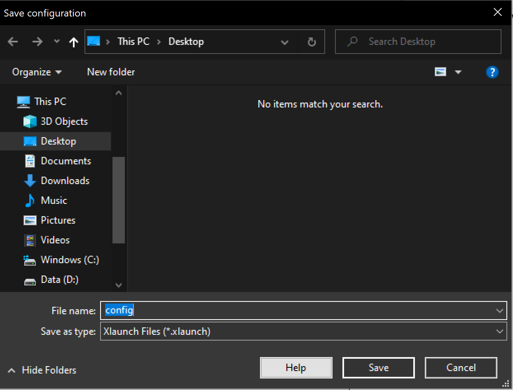

# Install intellij idea on WSL2

## Install X Server

### 1. Download the installer from the following link:

  https://sourceforge.net/projects/vcxsrv/

### 2. Execute the installer and install. (Select the default options during the installation.)

### 3. Launch X Server clicking the following icon on your desktop.


Click **[Next]**


Click **[Next]**


Check **[Disable access control]** and click **[Next]**


Click **[Set configuration]**


Click **[Save]** in the dialog



**NOTE:** You need to launch VcXsrv by double-clicking the saved configuration file starting next time.


Click **[Finish]**


Check the both security options then click **[Allow access]**


### 4. Execute the following command in your terminal:

```console
$ cat <<'END' >> ~/.bashrc
export DISPLAY="`grep nameserver /etc/resolv.conf | sed 's/nameserver //'`:0"
END

$ exec bash
```

## Chromium Browser

```console
$ sudo add-apt-repository ppa:saiarcot895/chromium-dev
$ sudo apt-get update
$ sudo apt-get install chromium-browser

$ chromium-browser
```

## Umake

```console
$ sudo apt-get install ubuntu-make

$ cat <<'END' >> ~/.bashrc
export PATH=$PATH:~/.local/share/umake/bin
END

$ exec bash
```

## Intellij Idea

```console
$ umake ide idea

$ jetbrains-idea-ce
```
