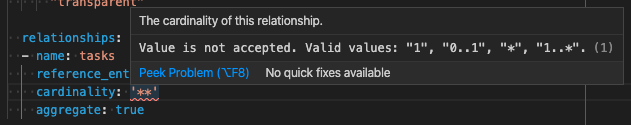

# ドメインモデルの作成

アプリケーションの問題領域を表現するドメインモデルを定義します。

## 作業手順

1. **プロジェクトフォルダに移動**

    ```console
    cd laplacian-tutorial
    ```

2. **ドメインモデルプロジェクトを作成**

    `create-new-domain-model-project.sh`スクリプトを実行します。
    ここでは全てデフォルト値を使用するので、リターンを押して進めてください。

    ```console
    $ ./scripts/create-new-domain-model-project.sh

    Enter project-name [domain-model]:

    Enter project-version [0.0.1]:

    Enter namespace [laplacian.tutorial]:
    ...

    Created the new project's definition at: laplacian-tutorial/model/project/subprojects/laplacian-tutorial/domain-model.yaml
    1. Edit this file if you need.
    2. Run ./scripts/generate-domain-model.sh to generate the project's content.
    ```

    ここでは、生成されたプロジェクト定義を修正する必要はないので、そのままプロジェクトを生成します。

    ```console
    ./scripts/generate-domain-model.sh
    ```

    生成されたコードをコミットします。

    ```console
    git add .
    ```

    ```console
    git commit -m 'add domain-model subproject.'
    ```

3. **ドメインモデルを作成**

    作成したサブプロジェクトをエディタで開きます。

    ```console
    code ./subprojects/domain-model/
    ```

    ドメインモデルを定義する`Yaml`ファイルを`src/model/entities`ディレクトリ配下に作成します。

    

    > `src/model/entities/task-group.yaml`

    ```yaml
    entities:
    - name: task_group
      namespace: laplacian.tutorial

      properties:
      - name: id
        type: string
        primary_key: true

      - name: title
        type: string

      - name: color
        type: string
        optional: true
        default_value: |
          "transparent"

      relationships:
      - name: tasks
        reference_entity_name: task
        cardinality: '*'
        aggregate: true
    ```

    > `src/model/entities/task.yaml`

    ```yaml
    entities:
    - name: task
      namespace: laplacian.tutorial

      properties:
      - name: seq_number
        type: number
        primary_key: true

      - name: title
        type: string

      - name: description
        type: string
        optional: true

      - name: completed
        type: boolean
        optional: true
        default_value: |
          false

      relationships:
      - name: task_group
        cardinality: '1'
        reference_entity_name: task_group
        reverse_of: tasks
    ```

    追加したモデルを検証し、その内容をプロジェクトに反映するため、再生成を行います。

    ```console
    ./scripts/generate-domain-model.sh
    ```

    > モデルの内容に問題があった場合、以下のようなエラーが出力されます。
    >
    > ```console
    > $ ./scripts/generate-domain-model.sh
    >
    > Caused by: java.lang.IllegalStateException: While merging the model file (laplacian-tutorial/subprojects/domain-model/.NEXT/dest/model/entities/task_group.yaml)
    > ...
    > Caused by: laplacian.util.JsonSchemaValidationError: $.entities[0].relationships[0].cardinality: does not have a value in the enumeration [1, 0..1, *, 1..*]
    >     at laplacian.util.YamlLoader$Companion.readObjects(YamlLoader.kt:57)
    >     at laplacian.util.YamlLoader$Companion.readObjects(YamlLoader.kt:36)
    >     ... 153 more
    > ```
    >
    > エディタに`VS-Code`を使用している場合は、エラー内容を随時エディタ上で確認できます。
    >
    > 

4. **作成したドメインモデルおよびプラグインをローカルモジュールリポジトリに登録**

    ```console
    ./scripts/publish-local-domain-model.sh
    ```

    作成したモデルをコミットします。

    ```console
    git add .
    ```

    ```console
    git commit -m 'add domain models.'
    ```
