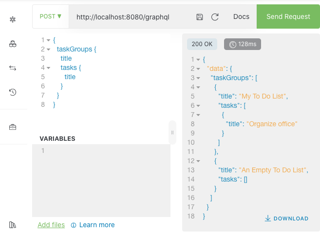

# APIサービスの生成と動作確認

アプリケーションAPIモデルから、APIサービスの実装を生成し、ローカルでの動作を確認します。

## 作業手順

1. **プロジェクトフォルダに移動**

    ```console
    cd laplacian-tutorial
    ```

2. **APIサービスプロジェクトを作成**

    `create-new-java-stack-service-generator-project.sh`スクリプトを実行します。
    ここでは全てデフォルト値を使用するので、リターンを押して進めてください。

    ```console
    $ ./scripts/create-new-java-stack-service-project.sh

    Enter project-name [java-stack-service]:

    Enter project-version [0.0.1]:

    Enter namespace [laplacian.tutorial]:
    ...

    The new subproject is created at ./subprojects/laplacian-tutorial.api-service/
    ```

    生成されたプロジェクトファイル (`src/project/subprojects/laplacian-tutorial/api-service.yaml`)をエディタで開き、先に作成したドメインモデルとアプリケーションモデルへの参照を追加します。

    ```console
    code .
    ```

    > `src/project/subprojects/laplacian-tutorial/java-stack-service.yaml`

    ```yaml
    _description: &description
      en: |
        The api-service project.

    _project: &project
      group: laplacian-tutorial
      type: java-stack-service
      name: java-stack-service
      namespace: laplacian.tutorial
      description: *description
      version: '0.0.1'
      # Insert the following lines into your project file.
      # From here...
      plugins:
      - group: laplacian-tutorial
        name: domain-model-plugin
        version: '0.0.1'
      models:
      - group: laplacian-tutorial
        name: domain-model
        version: '0.0.1'
      - group: laplacian-tutorial
        name: application-model
        version: '0.0.1'
      # ... to here.
    project:
      subprojects:
      - *project
    ```

3. **APIサービスを自動生成**

    この変更を反映するため、プロジェクトの再生成を行います。

    ```console
    ./scripts/generate.sh
    ```

    ```console
    ./scripts/generate-java-stack-service.sh
    ```

    プロジェクトモデルと生成されたコードをコミットします。

    ```console
    git add .
    ```

    ```console
    git commit -m 'add a project for a java stack implementation of the service.'
    ```

4. **テストデータを作成**

    動作確認用のテストデータを作成します。
    下記のパスにyamlファイルを追加してください。

    > `subprojects/java-stack-service/model/task_groups/test-data.yaml`

    ```yaml
    task_groups:
    - id: 66e3d018-f188-4bfe-8edc-2bccfec9456f
      title: My To Do List
      tasks:
      - seq_number: 1
        title: Hit the gym
      - seq_number: 2
        title: Pay bills
        completed: true
      - seq_number: 3
        title: Organize office
        description: |
          Start with a purge!
    - id: 65b7ffa0-e35f-49c1-8695-487c3e4798cc
      title: An Empty To Do List
      color: gray
    ```

    追加したテストデータを反映するためにプロジェクトを再生成します。

    ```console
    ./subproject/generate-java-stack-service/scripts/generate.sh
    ```

    テストデータおよび、テストデータから生成されたDML等をコミットします。

    ```console
    git add .
    ```

    ```console
    git commit -m 'add test data.'
    ```

5. **生成されたサービスをローカルで起動し動作を確認**

    生成したプロジェクトをローカル環境で起動します。

    ```console
    $ ./subproject/java-stack-service/scripts/deploy-on-local-containers.sh

    tutorial-api           | 2020-06-30 16:00:48.065  INFO 6 --- [           main] o.s.b.w.embedded.tomcat.TomcatWebServer  : Tomcat started on port(s): 8080 (http) with context path ''
    tutorial-api           | 2020-06-30 16:00:48.082  INFO 6 --- [           main] l.tutorial.api.TutorialApiApplicationKt  : Started TutorialApiApplicationKt in 15.096 seconds (JVM running for 17.481)
    ```

    上記のメッセージがコンソールに表示されたら、Webブラウザで <http://localhost:8080/altair> にアクセスしてください。

    表示された画面の左上の部分に下記のクエリを入力し、右上の **[Send Request]** と書かれたボタンを押してください。

    ```graphql
    {
      taskGroups {
        title
        tasks {
          title
        }
      }
    }
    ```

    以下のように、クエリの結果が右側の領域に表示されれば成功です。

    
